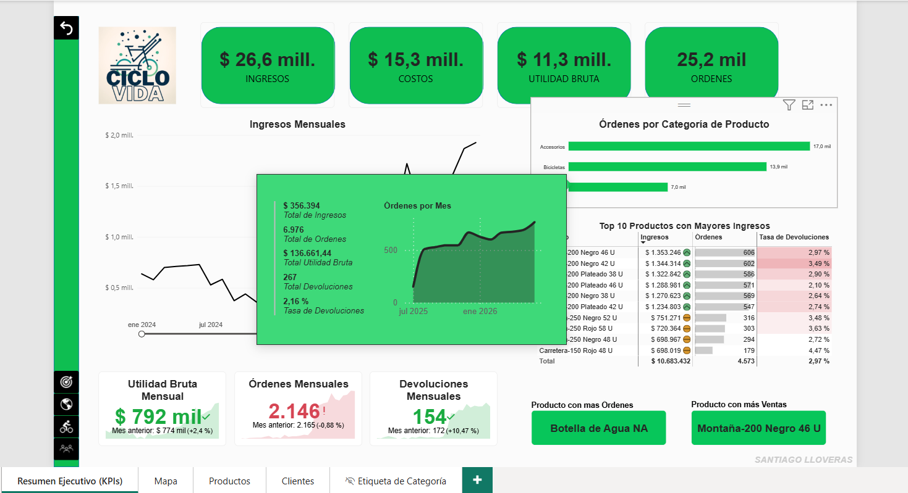
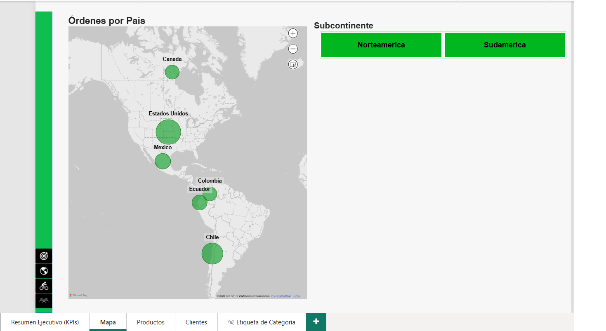
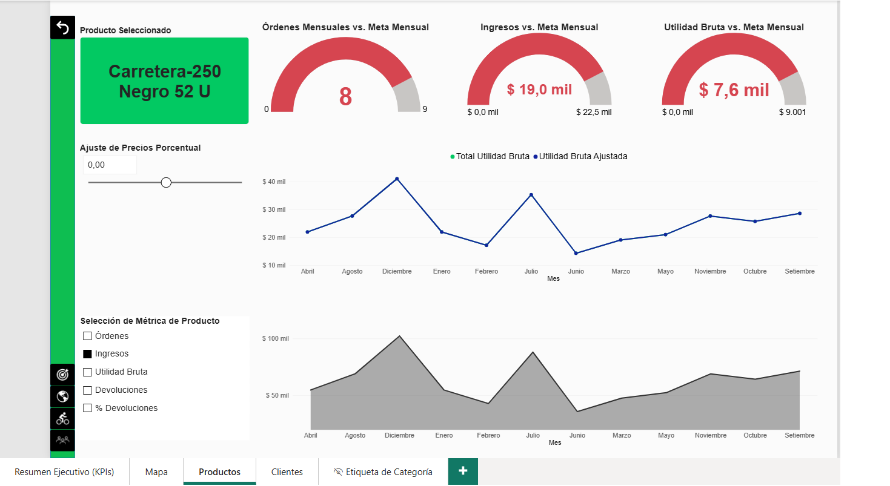
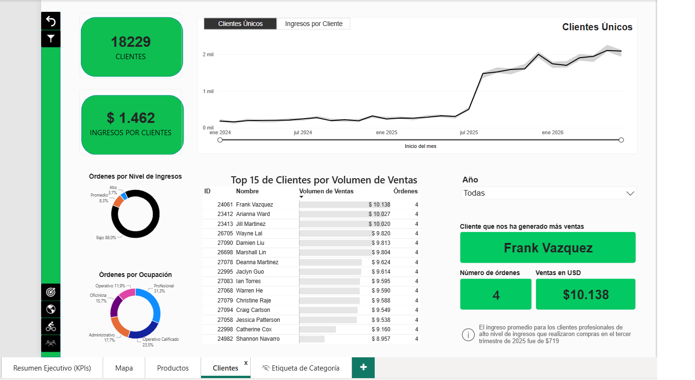

# Dashboard desarrollado como proyecto del curso sobre Power BI
- Transformación de datos dispersos en un reporte interactivo para monitoreo de KPIs y toma de decisiones.
- ETL con Power Query: limpieza, normalización, tratamiento de fechas, unificación de claves y manejo de nulos.
- DAX: medidas para KPIs, filtros dinámicos y cálculos temporales.
- Visualización: dashboard multipágina con filtros sincronizados, slicers, bookmarks y drill-through.
  
---

# Dashboard developed as a Power BI course project
- Transformation of scattered data into an interactive report for KPI monitoring and decision-making.
- ETL with Power Query: cleaning, normalization, date processing, key unification, and null handling.
- DAX: measures for KPIs, dynamic filters, and time-based calculations.
- Visualization: multi-page dashboard with synchronized filters, slicers, bookmarks, and drill-through.

---

